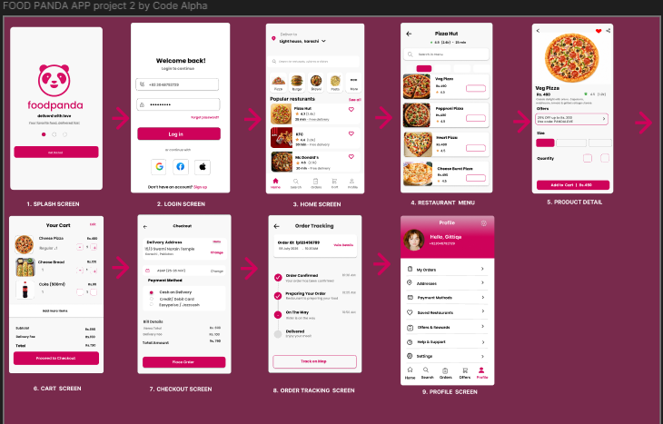

# Project 2 - High-Fidelity UI Design

This project was completed as part of my CodeAlpha UI/UX Design Internship.

## Project Overview

The objective of this project was to transform a low-fidelity wireframe into a high-fidelity mobile UI for a food delivery application using colors, typography, icons, and images while following UI/UX best practices.

## Preview

## PDF

[View Project PDF](./project2.pdf)

## Figma Design

https://www.figma.com/design/DQKU6qhrx4sd0uql0SD3xq/projects_CodeAlpha?node-id=124-1937&t=pcDcZ9mW27GqwbCI-1

## Tools Used

- Figma
- UI Design
- Prototyping

## Created By

**Gittiqa Maheshwari**
